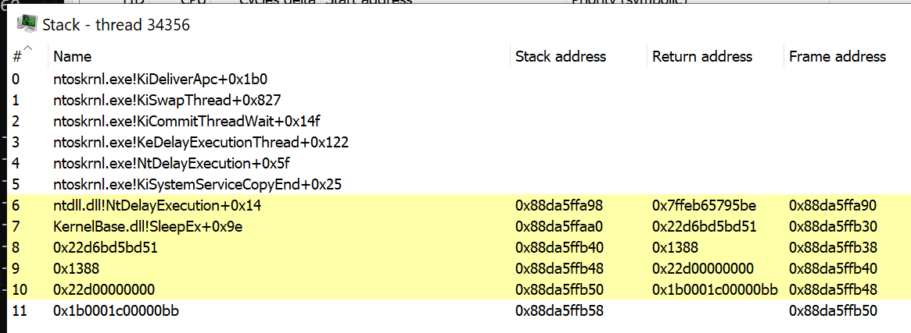
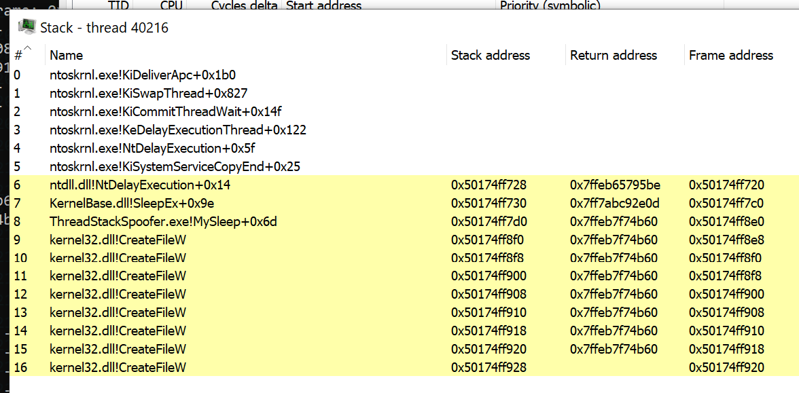

# Thread Stack Spoofing / Call Stack Spoofing PoC

A PoC implementation for an advanced in-memory evasion technique that spoofs Thread Call Stack. This technique allows to bypass thread-based memory examination rules and better hide shellcodes while in-process memory.

## Intro

This is an example implementation for _Thread Stack Spoofing_ technique aiming to evade Malware Analysts, AVs and EDRs looking for references to shellcode's frames in an examined thread's call stack.
The idea is to walk back thread's call stack and overwrite return addresses in subsequent function frames thus masquerading allocations containing malware's code.

An implementation may differ, however the idea is roughly similar to what [MDSec's Nighthawk C2](https://www.mdsec.co.uk/nighthawk/) offers for its agents.
Especially demonstrated in this video:

[Nighthawk - Thread Stack Spoofing](https://vimeo.com/581861665)

## How it works?

This program performs self-injection shellcode (roughly via classic `VirtualAlloc` + `memcpy` + `CreateThread`). 
Then when shellcode runs (this implementation specifically targets Cobalt Strike Beacon implants) a Windows function will be hooked intercepting moment when Beacon falls asleep `kernel32!Sleep`. 
Whenever hooked `MySleep` function gets invoked, it will spoof its own call stack leading to this `MySleep` function and begin sleeping. 
Having awaited for expected amount of time, the Thread's call stack will get restored assuring stable return and shellcode's execution resumption.

The rough algorithm is following:

1. Read shellcode's contents from file.
2. Acquire all the necessary function pointers from `dbghelp.dll`, call `SymInitialize`
3. Hook `kernel32!Sleep` pointing back to our callback.
4. Inject and launch shellcode via `VirtualAlloc` + `memcpy` + `CreateThread`. A slight twist here is that our thread starts from a legitimate `ntdll!RltUserThreadStart+0x21` address to mimic other threads
5. As soon as Beacon attempts to sleep, our `MySleep` callback gets invoked.
6. Stack Spoofing begins. 
7. Firstly we walk call stack of our current thread, utilising `ntdll!RtlCaptureContext` and `dbghelp!StackWalk64` 
8. We save all of the stack frames that match our `seems-to-be-beacon-frame` criterias (such as return address points back to a memory being `MEM_PRIVATE` or `Type = 0`, or memory's protection flags are not `R/RX/RWX`)
9. We terate over collected frames (gathered function frame pointers `RBP/EBP` - in `frame.frameAddr`) and overwrite _on-stack_ return addresses with a fake `::CreateFileW` address.
10. Finally a call to `::SleepEx` is made to let the Beacon's sleep while waiting for further communication.
11. After Sleep is finished, we restore previously saved original function return addresses and execution is resumed. 

Function return addresses are scattered all around the thread's stack memory area, pointed to by `RBP/EBP` register. In order to find them on the stack, we need to firstly collect frame pointers, then dereference them for overwriting:


_(the above image was borrowed from **Eli Bendersky's** post named [Stack frame layout on x86-64](https://eli.thegreenplace.net/2011/09/06/stack-frame-layout-on-x86-64/))_

```
	*(PULONG_PTR)(frameAddr + sizeof(void*)) = Fake_Return_Address;
```

This precise logic is provided by `walkCallStack` and `spoofCallStack` functions in `main.cpp`.


## Actually this is not (yet) a true stack spoofing

As it's been pointed out to me, the technique here is not _yet_ truly holding up to its name for being a _stack spoofer_. Since we're merely overwriting return addresses on the thread's stack, we're not spoofing the remaining areas of the stack itself. Moreover we leave a sequence of `::CreateFileW` addresses which looks very odd and let the thread be unable to unwind its stack. That's because `CreateFile` was meant to solely act as an example, we're making the stack non-unwindable but still obscuring references to our shellcode memory pages. 

However I'm aware of these shortcomings, at the moment I've left it as is since I cared mostly about evading automated scanners that could iterate over processes, enumerate their threads, walk those threads stacks and pick up on any return address pointing back to a non-image memory (such as `SEC_PRIVATE` - the one allocated dynamically by `VirtuaAlloc` and friends). A focused malware analyst would immediately spot the oddity and consider the thread rather unusual, hunting down our implant. More than sure about it. Yet, I don't believe that nowadays automated scanners such as AV/EDR have sorts of heuristics implemented that would _actually walk each thread's stack_ to verify whether its un-windable `¯\_(ツ)_/¯` .

Surely this project (and commercial implementation found in C2 frameworks) gives AV & EDR vendors arguments to consider implementing appropriate heuristics covering such a novel evasion technique.

The research on the subject is not yet finished and hopefully will result in a better quality _Stack Spoofing_ in upcoming days. Nonetheless, I'm releasing what I got so far in hope of sparkling inspirations and interest community into further researching this area.

Next areas improving the outcome are to research how we can _exchange_ or copy stacks (utilising [`GetCurrentThreadStackLimits`](https://docs.microsoft.com/en-us/windows/win32/api/processthreadsapi/nf-processthreadsapi-getcurrentthreadstacklimits)/`NtQueryInformationThread`) from a legitimate thread running `kernel32!Sleep(INFINITE)` or possibly by manipulating our Beacon's thread `TEB/TIB` structures and fields such as `TebBaseAddress` providing shadowed TEB. Another idea would be to play with `RBP/EBP` and `RSP/ESP` pointers on a paused Beacon's thread to change stacks in a similar manner to ROP chains.


## How do I use it?

Look at the code and its implementation, understand the concept and re-implement the concept within your own Shellcode Loaders that you utilise to deliver your Red Team engagements.
This is an yet another technique for advanced in-memory evasion that increases your Teams' chances for not getting caught by Anti-Viruses, EDRs and Malware Analysts taking look at your implants.

While developing your advanced shellcode loader, you might also want to implement:

- **Process Heap Encryption** - take an inspiration from this blog post: [Hook Heaps and Live Free](https://www.arashparsa.com/hook-heaps-and-live-free/) - which can let you evade Beacon configuration extractors like [`BeaconEye`](https://github.com/CCob/BeaconEye)
- **Change your Beacon's memory pages protection to `RW` (from `RX/RWX`) and encrypt their contents** before sleeping (that could evade scanners such as [`Moneta`](https://github.com/forrest-orr/moneta) or [`pe-sieve`](https://github.com/hasherezade/pe-sieve))
- **Clear out any leftovers from Reflective Loader** to avoid in-memory signatured detections
- **Unhook everything you might have hooked** (such as AMSI, ETW, WLDP) before sleeping and then re-hook afterwards.


## Demo

This is how a call stack may look like when it is **NOT** spoofed:



This in turn, when thread stack spoofing is enabled:



Above we can see a sequence of `kernel32!CreateFileW` being implanted as return addresses. That's merely an example proving that we can manipulate return addresses.
To better enhance quality of this call stack, one could prepare a list of addresses and then use them while picking subsequent frames for overwriting.

For example, a following chain of addresses could be used:

```
KernelBase.dll!WaitForSingleObjectEx+0x8e
KernelBase.dll!WaitForSingleObject+0x52
kernel32!BaseThreadInitThunk+0x14
ntdll!RtlUserThreadStart+0x21
``` 

When thinking about AVs, EDRs and other automated scanners - we don't need to care about how much legitimate our thread's call stack look, since these scanners only care whether a frame points back to a `SEC_IMAGE` memory pages, meaning it was a legitimate DLL/EXE call (and whether these DLLs are trusted/signed themselves). Thus, we don't need to bother that much about these chain of `CreateFileW` frames.


## Example run

Use case:

```
C:\> ThreadStackSpoofer.exe <shellcode> <spoof>
```

Where:
- `<shellcode>` is a path to the shellcode file
- `<spoof>` when `1` or `true` will enable thread stack spoofing and anything else disables it.


Example run that spoofs beacon's thread call stack:

```
C:\> ThreadStackSpoofer.exe beacon64.bin 1
[.] Reading shellcode bytes...
[.] Thread call stack will be spoofed.
[+] Stack spoofing initialized.
[.] Hooking kernel32!Sleep...
[.] Injecting shellcode...

WalkCallStack: Stack Trace:
        2.      calledFrom: 0x7ff7c8ba7f54 - stack: 0xdc5eaffbd0 - frame: 0xdc5eaffce0 - ret: 0x2550d3ebd51 - skip? 0
        3.      calledFrom: 0x2550d3ebd51 - stack: 0xdc5eaffcf0 - frame: 0xdc5eaffce8 - ret: 0x1388 - skip? 0
        4.      calledFrom: 0x    1388 - stack: 0xdc5eaffcf8 - frame: 0xdc5eaffcf0 - ret: 0x2550d1ff760 - skip? 0
        5.      calledFrom: 0x2550d1ff760 - stack: 0xdc5eaffd00 - frame: 0xdc5eaffcf8 - ret: 0x1b000100000004 - skip? 0
        6.      calledFrom: 0x1b000100000004 - stack: 0xdc5eaffd08 - frame: 0xdc5eaffd00 - ret: 0xd00017003a0001 - skip? 0
        7.      calledFrom: 0xd00017003a0001 - stack: 0xdc5eaffd10 - frame: 0xdc5eaffd08 - ret: 0x2550d5b7040 - skip? 0
        8.      calledFrom: 0x2550d5b7040 - stack: 0xdc5eaffd18 - frame: 0xdc5eaffd10 - ret: 0x2550d3ccd9f - skip? 0
        9.      calledFrom: 0x2550d3ccd9f - stack: 0xdc5eaffd20 - frame: 0xdc5eaffd18 - ret: 0x2550d3ccdd0 - skip? 0
                        Spoofed: 0x2550d3ebd51 -> 0x7ffeb7f74b60
                        Spoofed: 0x00001388 -> 0x7ffeb7f74b60
                        Spoofed: 0x2550d1ff760 -> 0x7ffeb7f74b60
                        Spoofed: 0x1b000100000004 -> 0x7ffeb7f74b60
                        Spoofed: 0xd00017003a0001 -> 0x7ffeb7f74b60
                        Spoofed: 0x2550d5b7040 -> 0x7ffeb7f74b60
                        Spoofed: 0x2550d3ccd9f -> 0x7ffeb7f74b60
                        Spoofed: 0x2550d3ccdd0 -> 0x7ffeb7f74b60

===> MySleep(5000)

[+] Shellcode is now running.

WalkCallStack: Stack Trace:
        2.      calledFrom: 0x7ff7c8ba7f84 - stack: 0xdc5eaffbd0 - frame: 0xdc5eaffce0 - ret: 0x7ffeb7f74b60 - skip? 1
        3.      calledFrom: 0x7ffeb7f74b60 - stack: 0xdc5eaffcf0 - frame: 0xdc5eaffce8 - ret: 0x7ffeb7f74b60 - skip? 1
        4.      calledFrom: 0x7ffeb7f74b60 - stack: 0xdc5eaffcf8 - frame: 0xdc5eaffcf0 - ret: 0x7ffeb7f74b60 - skip? 1
        5.      calledFrom: 0x7ffeb7f74b60 - stack: 0xdc5eaffd00 - frame: 0xdc5eaffcf8 - ret: 0x7ffeb7f74b60 - skip? 1
        6.      calledFrom: 0x7ffeb7f74b60 - stack: 0xdc5eaffd08 - frame: 0xdc5eaffd00 - ret: 0x7ffeb7f74b60 - skip? 1
        7.      calledFrom: 0x7ffeb7f74b60 - stack: 0xdc5eaffd10 - frame: 0xdc5eaffd08 - ret: 0x7ffeb7f74b60 - skip? 1
        8.      calledFrom: 0x7ffeb7f74b60 - stack: 0xdc5eaffd18 - frame: 0xdc5eaffd10 - ret: 0x7ffeb7f74b60 - skip? 1
        9.      calledFrom: 0x7ffeb7f74b60 - stack: 0xdc5eaffd20 - frame: 0xdc5eaffd18 - ret: 0x7ffeb7f74b60 - skip? 1
                        Restored: 0x7ffeb7f74b60 -> 0x2550d3ebd51
                        Restored: 0x7ffeb7f74b60 -> 0x1388
                        Restored: 0x7ffeb7f74b60 -> 0x2550d1ff760
                        Restored: 0x7ffeb7f74b60 -> 0x1b000100000004
                        Restored: 0x7ffeb7f74b60 -> 0xd00017003a0001
                        Restored: 0x7ffeb7f74b60 -> 0x2550d5b7040
                        Restored: 0x7ffeb7f74b60 -> 0x2550d3ccd9f
                        Restored: 0x7ffeb7f74b60 -> 0x2550d3ccdd0
```

## Word of caution

If you plan on adding this functionality to your own shellcode loaders / toolings be sure to **AVOID** unhooking `kernel32.dll`.
An attempt to unhook `kernel32` will restore original `Sleep` functionality preventing our callback from being called.
If our callback is not called, the thread will be unable to spoof its own call stack by itself.

If that's what you want to have, than you might need to run another, watchdog thread, making sure that the Beacons thread will get spoofed whenever it sleeps.

If you're using Cobalt Strike and a BOF `unhook-bof` by Raphael's Mudge, be sure to check out my [Pull Request](https://github.com/Cobalt-Strike/unhook-bof/pull/1) that adds optional parameter to the BOF specifying libraries that should not be unhooked.

This way you can maintain your hooks in kernel32:

```
beacon> unhook kernel32
[*] Running unhook.
    Will skip these modules: wmp.dll, kernel32.dll
[+] host called home, sent: 9475 bytes
[+] received output:
ntdll.dll            <.text>
Unhook is done.
```

[Modified `unhook-bof` with option to ignore specified modules](https://github.com/mgeeky/unhook-bof)


## Author

```
Mariusz Banach / mgeeky, 
<mb [at] binary-offensive.com>, '21
```
