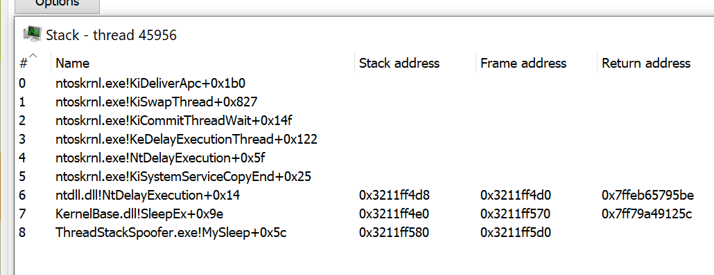
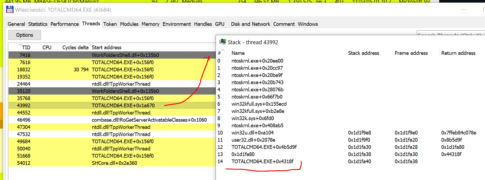

# Thread Stack Spoofing / Call Stack Spoofing PoC

A PoC implementation for an advanced in-memory evasion technique that spoofs Thread Call Stack. This technique allows to bypass thread-based memory examination rules and better hide shellcodes while in-process memory.

## Intro

This is an example implementation for _Thread Stack Spoofing_ technique aiming to evade Malware Analysts, AVs and EDRs looking for references to shellcode's frames in an examined thread's call stack.
The idea is to walk back thread's call stack and overwrite return addresses in subsequent function frames thus masquerading allocations containing malware's code.

An implementation may differ, however the idea is roughly similar to what commercial C2 frameworks offer for its agents.

Implementation along with my [ShellcodeFluctuation](https://github.com/mgeeky/ShellcodeFluctuation) brings Offensive Security community sample implementations to catch up on the offering made by commercial C2 products, so that we can do no worse in our Red Team toolings. 💪


### Implementation has changed 

Current implementation differs heavily to what was originally published. This is because I realised that there is a way simpler approach to terminate thread's call stack and hide shellcode's related frames by simply writing `0` to the return address of our handler:

```
void WINAPI MySleep(DWORD _dwMilliseconds)
{
    [...]
    PULONG_PTR overwrite = (PULONG_PTR)_AddressOfReturnAddress();
    *overwrite = 0;

    [...]
    *overwrite = origReturnAddress;
}
```

The previous implementation, utilising `StackWalk64` can be accessed in this [commit c250724](https://github.com/mgeeky/ThreadStackSpoofer/tree/c2507248723d167fb2feddf50d35435a17fd61a2).


## How it works?

This program performs self-injection shellcode (roughly via classic `VirtualAlloc` + `memcpy` + `CreateThread`). 
Then when shellcode runs (this implementation specifically targets Cobalt Strike Beacon implants) a Windows function will be hooked intercepting moment when Beacon falls asleep `kernel32!Sleep`. 
Whenever hooked `MySleep` function gets invoked, it will spoof its own call stack leading to this `MySleep` function and begin sleeping. 
Having awaited for expected amount of time, the Thread's call stack will get restored assuring stable return and shellcode's execution resumption.

The rough algorithm is following:

1. Read shellcode's contents from file.
2. Acquire all the necessary function pointers from `dbghelp.dll`, call `SymInitialize`
3. Hook `kernel32!Sleep` pointing back to our callback.
4. Inject and launch shellcode via `VirtualAlloc` + `memcpy` + `CreateThread`. A slight twist here is that our thread starts from a legitimate `ntdll!RltUserThreadStart+0x21` address to mimic other threads
5. As soon as Beacon attempts to sleep, our `MySleep` callback gets invoked.
6. Overwrite last return address on the stack to `0` which effectively should finish the call stack.
7. Finally a call to `::SleepEx` is made to let the Beacon's sleep while waiting for further communication.
8. After Sleep is finished, we restore previously saved original function return addresses and execution is resumed. 

Function return addresses are scattered all around the thread's stack memory area, pointed to by `RBP/EBP` register. In order to find them on the stack, we need to firstly collect frame pointers, then dereference them for overwriting:


_(the above image was borrowed from **Eli Bendersky's** post named [Stack frame layout on x86-64](https://eli.thegreenplace.net/2011/09/06/stack-frame-layout-on-x86-64/))_

```
	*(PULONG_PTR)(frameAddr + sizeof(void*)) = Fake_Return_Address;
```

This precise logic is provided by `walkCallStack` and `spoofCallStack` functions in `main.cpp`.


## Demo

This is how a call stack may look like when it is **NOT** spoofed:


This in turn, when thread stack spoofing is enabled:



Above we can see that the last frame on our call stack is our `MySleep` callback. That immediately brings opportunities for IOCs hunting for threads having call stacks not unwinding into following two commonly expected system entry points:
```
kernel32!BaseThreadInitThunk+0x14
ntdll!RtlUserThreadStart+0x21
```

However a brief examination of my system shown, that there are plenty of threads having call stacks not unwinding to the above handlers:



The above screenshot shows unmodified, unhooked, thread of Total Commander x64.

Why should we care about carefully faking our call stack when there are processes exhibiting traits that we can simply mimic?


## How do I use it?

Look at the code and its implementation, understand the concept and re-implement the concept within your own Shellcode Loaders that you utilise to deliver your Red Team engagements.
This is an yet another technique for advanced in-memory evasion that increases your Teams' chances for not getting caught by Anti-Viruses, EDRs and Malware Analysts taking look at your implants.

While developing your advanced shellcode loader, you might also want to implement:

- **Process Heap Encryption** - take an inspiration from this blog post: [Hook Heaps and Live Free](https://www.arashparsa.com/hook-heaps-and-live-free/) - which can let you evade Beacon configuration extractors like [`BeaconEye`](https://github.com/CCob/BeaconEye)
- **Change your Beacon's memory pages protection to `RW` (from `RX/RWX`) and encrypt their contents** - using [Shellcode Fluctuation](https://github.com/mgeeky/ShellcodeFluctuation) technique - right before sleeping (that could evade scanners such as [`Moneta`](https://github.com/forrest-orr/moneta) or [`pe-sieve`](https://github.com/hasherezade/pe-sieve))
- **Clear out any leftovers from Reflective Loader** to avoid in-memory signatured detections
- **Unhook everything you might have hooked** (such as AMSI, ETW, WLDP) before sleeping and then re-hook afterwards.


## Actually this is not (yet) a true stack spoofing

As it's been pointed out to me, the technique here is not _yet_ truly holding up to its name for being a _stack spoofer_. Since we're merely overwriting return addresses on the thread's stack, we're not spoofing the remaining areas of the stack itself. Moreover we leave a sequence of `::CreateFileW` addresses which looks very odd and let the thread be unable to unwind its stack. That's because `CreateFile` was meant to solely act as an example, we're making the stack non-unwindable but still obscuring references to our shellcode memory pages. 

However I'm aware of these shortcomings, at the moment I've left it as is since I cared mostly about evading automated scanners that could iterate over processes, enumerate their threads, walk those threads stacks and pick up on any return address pointing back to a non-image memory (such as `SEC_PRIVATE` - the one allocated dynamically by `VirtuaAlloc` and friends). A focused malware analyst would immediately spot the oddity and consider the thread rather unusual, hunting down our implant. More than sure about it. Yet, I don't believe that nowadays automated scanners such as AV/EDR have sorts of heuristics implemented that would _actually walk each thread's stack_ to verify whether its un-windable `¯\_(ツ)_/¯` .

Surely this project (and commercial implementation found in C2 frameworks) gives AV & EDR vendors arguments to consider implementing appropriate heuristics covering such a novel evasion technique.

The research on the subject is not yet finished and hopefully will result in a better quality _Stack Spoofing_ in upcoming days. Nonetheless, I'm releasing what I got so far in hope of sparkling inspirations and interest community into further researching this area.

Next areas for improving the outcome are to research how we can _exchange_ or copy stacks with one of the following ideas:

1. utilising [`GetCurrentThreadStackLimits`](https://docs.microsoft.com/en-us/windows/win32/api/processthreadsapi/nf-processthreadsapi-getcurrentthreadstacklimits)/`NtQueryInformationThread`) from a legitimate thread running `kernel32!Sleep(INFINITE)`

2. manipulating our Beacon's thread `TEB/TIB` structures and fields such as `TebBaseAddress`, `NT_TIB.StackBase / NT_TIB.StackLimit` by swapping them with values taken from another legitimate thread.

3. playing with `RBP/EBP` and `RSP/ESP` pointers on a paused Beacon's thread to change stacks in a similar manner to ROP chains - by swapping values of these registers while Beacon's thread is suspended.

4. Create a new user stack with `RtlCreateUserStack` / `RtlFreeUserStack` and exchange stacks from a Beacons thread into that newly created one


## Implementing a true Thread Stack Spoofer

Hours-long conversation with [namazso](https://twitter.com/namazso) teached me, that in order to aim for a proper thread stack spoofer we would need to reverse x64 call stack unwinding process.
Firstly, one needs to carefully acknowledge the stack unwinding process explained in (a) linked below. The system when traverses Thread call stack on x64 architecture will not simply rely on return addresses scattered around the thread's stack, but rather it:

1. takes return address
2. attempts to identify function containing that address (with [RtlLookupFunctionEntry](https://docs.microsoft.com/en-us/windows/win32/api/winnt/nf-winnt-rtllookupfunctionentry))
3. That function returns `RUNTIME_FUNCTION`, `UNWIND_INFO` and `UNWIND_CODE` structures. These structures describe where are the function's beginning address, ending address, and where are all the code sequences that modify `RBP` or `RSP`. 
4. System needs to know about all stack & frame pointers modifications that happened in each function across the Call Stack to then virtually _rollback_ these changes and virtually restore call stack pointers when a call to the processed call stack frame happened (this is implemented in [RtlVirtualUnwind](https://docs.microsoft.com/ru-ru/windows/win32/api/winnt/nf-winnt-rtlvirtualunwind))
5. The system processes all `UNWIND_CODE`s that examined function exhbits to precisely compute the location of that frame's return address and stack pointer value.
6. Through this emulation, the System is able to walk down the call stacks chain and effectively "unwind" the call stack.

In order to interfere with this process we wuold need to _revert it_ by having our reverted form of `RtlVirtualUnwind`. We would need to iterate over functions defined in a module (let's be it `kernel32`), scan each function's `UNWIND_CODE` codes and closely emulate it backwards (as compared to `RtlVirtualUnwind` and precisely `RtlpUnwindPrologue`) in order to find locations on the stack, where to put our fake return addresses.

[namazso](https://twitter.com/namazso) mentions the necessity to introduce 3 fake stack frames to nicely stitch the call stack:

1. A "desync" frame (consider it as a _gadget-frame_) that unwinds differently compared to the caller of our `MySleep` (having differnt `UWOP` - Unwind Operation code). We do this by looking through all functions from a module, looking through their UWOPs, calculating how big the fake frame should be. This frame must have UWOPS **different** than our `MySleep`'s caller.
2. Next frame that we want to find is a function that unwindws by popping into `RBP` from the stack - basically through `UWOP_PUSH_NONVOL` code.
3. Third frame we need a function that restores `RSP` from `RBP` through the code `UWOP_SET_FPREG`

The restored `RSP` must be set with the `RSP` taken from wherever control flow entered into our `MySleep` so that all our frames become hidden, as a result of third gadget unwinding there.

In order to begin the process, one can iterate over executable's `.pdata` by dereferencing `IMAGE_DIRECTORY_ENTRY_EXCEPTION` data directory entry.
Consider below example:

```
    ULONG_PTR imageBase = (ULONG_PTR)GetModuleHandleA("kernel32");
    PIMAGE_NT_HEADERS64 pNthdrs = PIMAGE_NT_HEADERS64(imageBase + PIMAGE_DOS_HEADER(imageBase)->e_lfanew);

    auto excdir = pNthdrs->OptionalHeader.DataDirectory[IMAGE_DIRECTORY_ENTRY_EXCEPTION];
    if (excdir.Size == 0 || excdir.VirtualAddress == 0)
        return;

    auto begin = PRUNTIME_FUNCTION(excdir.VirtualAddress + imageBase);
    auto end = PRUNTIME_FUNCTION(excdir.VirtualAddress + imageBase + excdir.Size);

    UNWIND_HISTORY_TABLE mshist = { 0 };
    DWORD64 imageBase2 = 0;

    PRUNTIME_FUNCTION currFrame = RtlLookupFunctionEntry(
        (DWORD64)caller,
        &imageBase2,
        &mshist
    );

    UNWIND_INFO *mySleep = (UNWIND_INFO*)(currFrame->UnwindData + imageBase);
    UNWIND_CODE myFrameUwop = (UNWIND_CODE)(mySleep->UnwindCodes[0]);

    log("1. MySleep RIP UWOP: ", myFrameUwop.UnwindOpcode);

    for (PRUNTIME_FUNCTION it = begin; it < end; ++it)
    {
        UNWIND_INFO* unwindData = (UNWIND_INFO*)(it->UnwindData + imageBase);
        UNWIND_CODE frameUwop = (UNWIND_CODE)(unwindData->UnwindCodes[0]);

        if (frameUwop.UnwindOpcode != myFrameUwop.UnwindOpcode)
        {
            // Found candidate function for a desynch gadget frame

        }
    }
```

The process is a bit convoluted, yet boils down to reverting thread's call stack unwinding process by substituting arbitrary stack frames with carefully selected other ones, in a ROP alike approach.

This PoC does not follows replicate this algorithm, because my current understanding allows me to accept the call stack finishing on an `EXE`-based stack frame and I don't want to overcompliate neither my shellcode loaders nor this PoC. Leaving the exercise of implementing this and sharing publicly to a keen reader. Or maybe I'll sit and have a try on doing this myself given some more spare time :)


**More information**:

a) [x64 exception handling - Stack Unwinding process explained](https://docs.microsoft.com/en-us/cpp/build/exception-handling-x64?view=msvc-160)
b) [Sample implementation of `RtlpUnwindPrologue` and `RtlVirtualUnwind`](https://github.com/mic101/windows/blob/master/WRK-v1.2/base/ntos/rtl/amd64/exdsptch.c)
c) [`.pdata` section](https://docs.microsoft.com/en-us/windows/win32/debug/pe-format#the-pdata-section)
d) [another sample implementation of `RtlpUnwindPrologue`](https://github.com/hzqst/unicorn_pe/blob/master/unicorn_pe/except.cpp#L773)


## Example run

Use case:

```
C:\> ThreadStackSpoofer.exe <shellcode> <spoof>
```

Where:
- `<shellcode>` is a path to the shellcode file
- `<spoof>` when `1` or `true` will enable thread stack spoofing and anything else disables it.


Example run that spoofs beacon's thread call stack:

```
PS D:\dev2\ThreadStackSpoofer> .\x64\Release\ThreadStackSpoofer.exe .\tests\beacon64.bin 1
[.] Reading shellcode bytes...
[.] Hooking kernel32!Sleep...
[.] Injecting shellcode...
[+] Shellcode is now running.
[>] Original return address: 0x1926747bd51. Finishing call stack...

===> MySleep(5000)

[<] Restoring original return address...
[>] Original return address: 0x1926747bd51. Finishing call stack...

===> MySleep(5000)

[<] Restoring original return address...
[>] Original return address: 0x1926747bd51. Finishing call stack...
```

## Word of caution

If you plan on adding this functionality to your own shellcode loaders / toolings be sure to **AVOID** unhooking `kernel32.dll`.
An attempt to unhook `kernel32` will restore original `Sleep` functionality preventing our callback from being called.
If our callback is not called, the thread will be unable to spoof its own call stack by itself.

If that's what you want to have, than you might need to run another, watchdog thread, making sure that the Beacons thread will get spoofed whenever it sleeps.

If you're using Cobalt Strike and a BOF `unhook-bof` by Raphael's Mudge, be sure to check out my [Pull Request](https://github.com/Cobalt-Strike/unhook-bof/pull/1) that adds optional parameter to the BOF specifying libraries that should not be unhooked.

This way you can maintain your hooks in kernel32:

```
beacon> unhook kernel32
[*] Running unhook.
    Will skip these modules: wmp.dll, kernel32.dll
[+] host called home, sent: 9475 bytes
[+] received output:
ntdll.dll            <.text>
Unhook is done.
```

[Modified `unhook-bof` with option to ignore specified modules](https://github.com/mgeeky/unhook-bof)

---

## Final remark

This PoC was designed to work with Cobalt Strike's Beacon shellcodes. The Beacon is known to call out to `kernel32!Sleep` to await further instructions from its C2. 
This loader leverages that fact by hooking `Sleep` in order to perform its housekeeping. 

This implementation might not work with other shellcodes in the market (such as _Meterpreter_) if they don't use `Sleep` to cool down. 
Since this is merely a _Proof of Concept_ showing the technique, I don't intend on adding support for any other C2 framework.

When you understand the concept, surely you'll be able to translate it into your shellcode requirements and adapt the solution for your advantage.

Please do not open Github issues related to "this code doesn't work with XYZ shellcode", they'll be closed immediately.

---

### ☕ Show Support ☕

This and other projects are outcome of sleepless nights and **plenty of hard work**. If you like what I do and appreciate that I always give back to the community,
[Consider buying me a coffee](https://github.com/sponsors/mgeeky) _(or better a beer)_ just to say thank you! 💪 

---

## Author

```   
   Mariusz Banach / mgeeky, 21
   <mb [at] binary-offensive.com>
   (https://github.com/mgeeky)
```
